# FineDine - Full Stack Restaurant Management System

A full-stack restaurant web application that allows users to browse the menu, create an account, reserve tables, order food, subscribe to the restaurant newsletter, and complete a checkout process. The project was built to practice full-stack development by integrating a React frontend with a Spring Boot backend and a MySQL database.

The application includes secure user authentication using Spring Security, a shopping cart, a table reservation system, and a responsive user interface designed to simulate a real restaurant website.

This project helped me gain practical experience in building secure REST APIs, implementing user authentication, managing application state, and connecting a frontend with a backend.

---

## Features

### User Authentication
- User registration
- User login
- Password encryption using BCrypt
- Authentication using Spring Security
- Persistent login using Local Storage
- Protected routes for authenticated users

### Restaurant Menu
- Browse available food items
- View food details
- Add food to cart

### Shopping Cart
- Add items to cart
- Increase and decrease item quantity
- Remove items from cart
- Live cart counter in the navigation bar
- Clear cart functionality

### Reservation System
- Reserve a table
- Select date and time
- Number of guests
- Occasion selection
- Seating preference
- Special requests
- View reservations

### Checkout
- Order summary
- Checkout page
- Order confirmation screen after successful checkout

  ### Newsletter
- Subscribe to the restaurant newsletter
- Email integration using EmailJS
- Sends subscription requests without requiring a backend service

---

## Technologies Used

### Frontend
- React
- React Router DOM
- JavaScript
- HTML5
- CSS3
- Context API
- Local Storage
- Vite
- EmailJS

### Backend
- Java
- Spring Boot
- Spring Security
- Spring Data JPA
- Maven
- Lombok
- Bean Validation

### Database
- MySQL

### Development Tools
- IntelliJ IDEA
- Visual Studio Code
- Postman
- Git
- GitHub

---

## Project Structure

```
FineDine
│
├── FineDine-Frontend
├── FineDine-Backend
└── Screenshots
```

---

## Screenshots

### Home Page

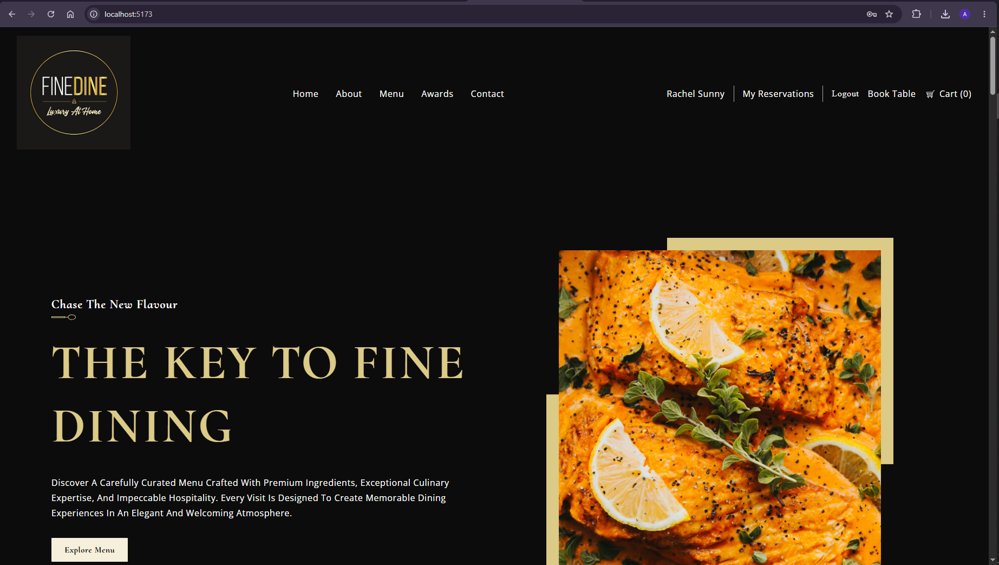

---

### Registration

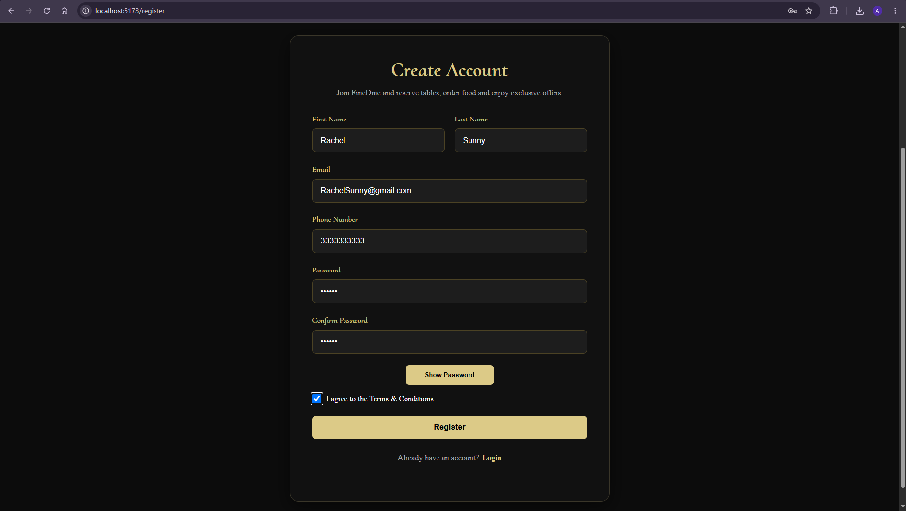

---

### Login

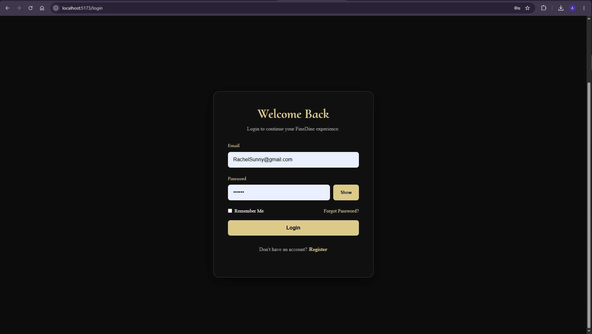

---

### Menu

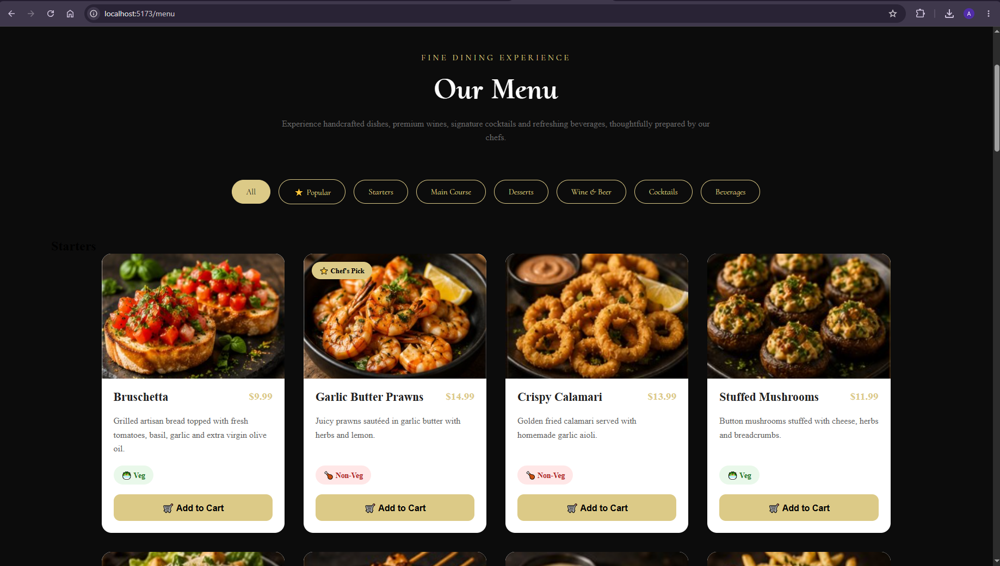

---

### Book a Table

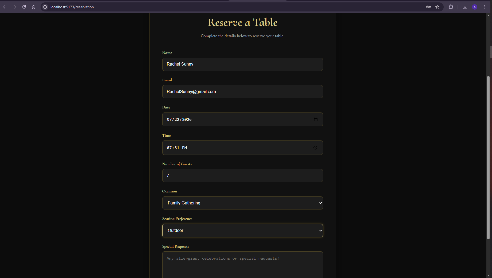

---

### My Reservations

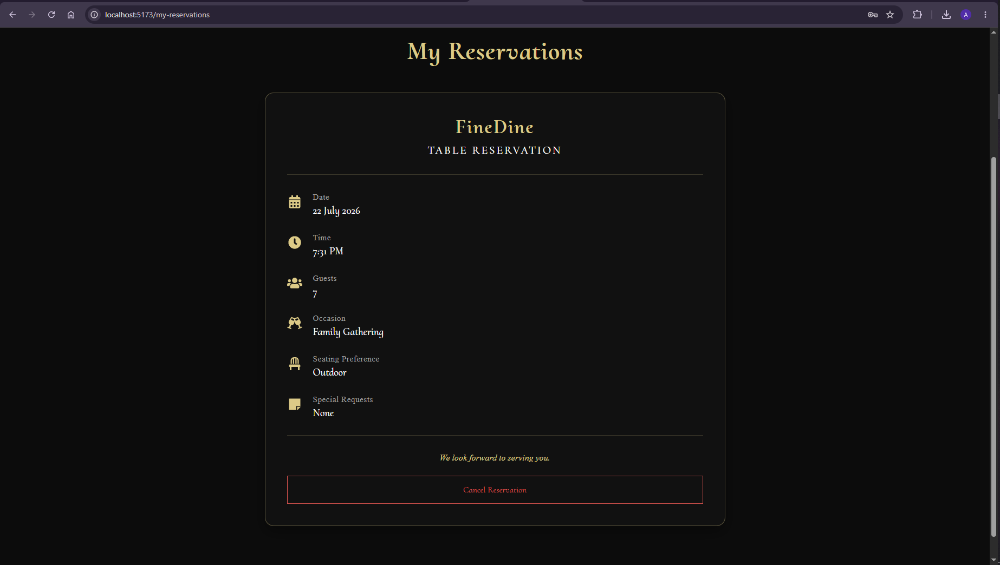

---

### Shopping Cart

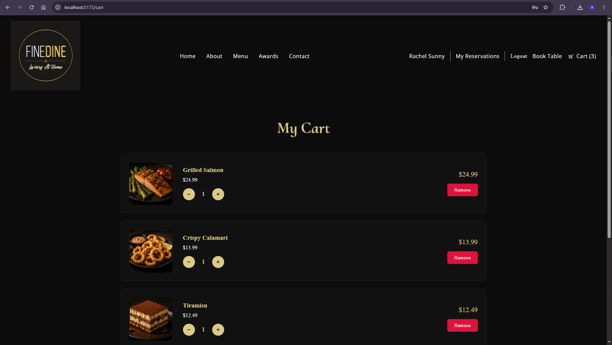

---

### Updated Cart

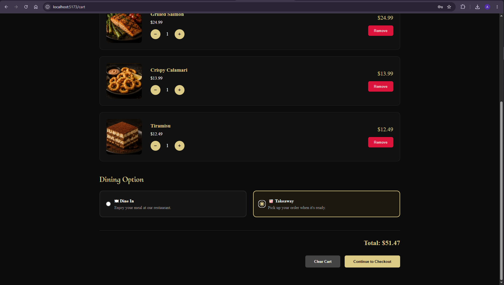

---

### Checkout

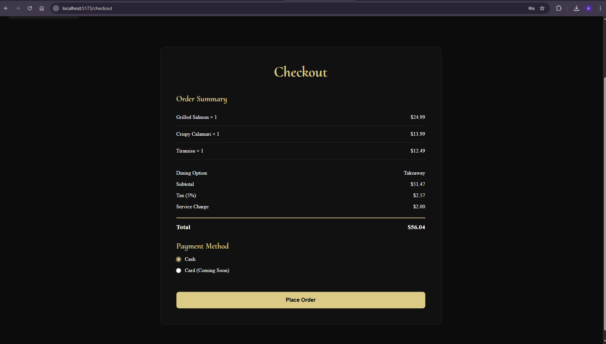

---

### Order Confirmation

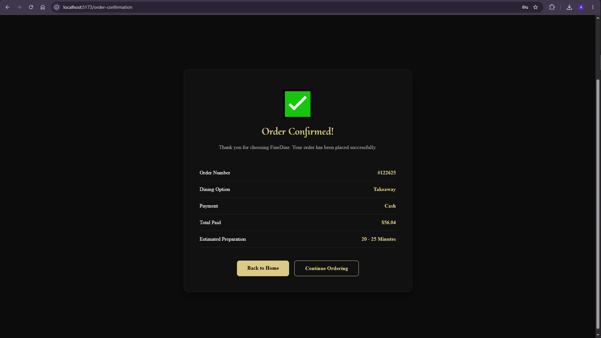

---

### Newsletter

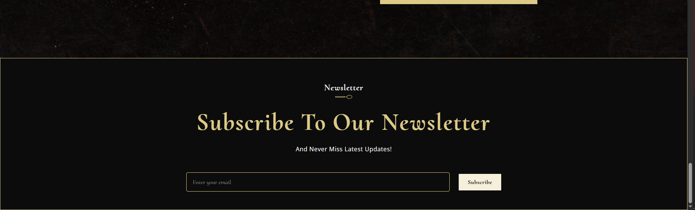

---

## Getting Started

### Clone the repository

```bash
git clone https://github.com/AnushkaSunny/FineDine-fullstack.git
```

---

### Frontend

```bash
cd FineDine-Frontend
npm install
npm run dev
```

---

### Backend

```bash
cd FineDine-Backend
mvn spring-boot:run
```

---

## What I Learned

Building this project gave me hands-on experience with:

- Developing REST APIs using Spring Boot
- Connecting a React frontend with a Java backend
- Implementing authentication and authorization with Spring Security
- Using BCrypt to securely store passwords
- Managing application state using React Context API
- Working with MySQL using Spring Data JPA
- Creating reusable React components
- Organizing a full-stack application into separate frontend and backend projects
- Using Git and GitHub for version control

---

## Future Improvements

Some features I would like to add in the future:

- Admin dashboard
- Online payment integration
- Email confirmation for reservations
- Food search and filtering
- User profile management
- Order history
- Responsive mobile optimization
- Docker deployment

---

## Author

**Anushka Sunny**

GitHub: https://github.com/YOUR_USERNAME
